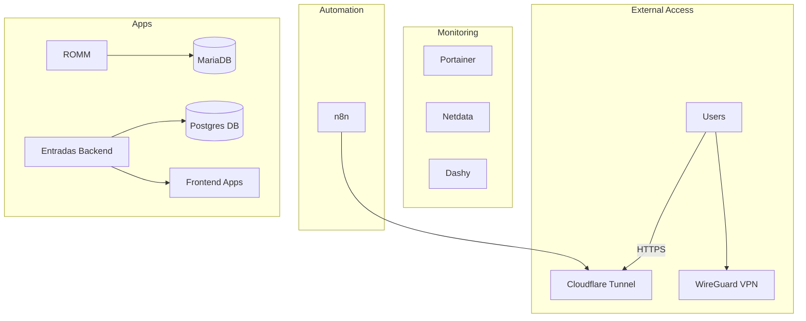
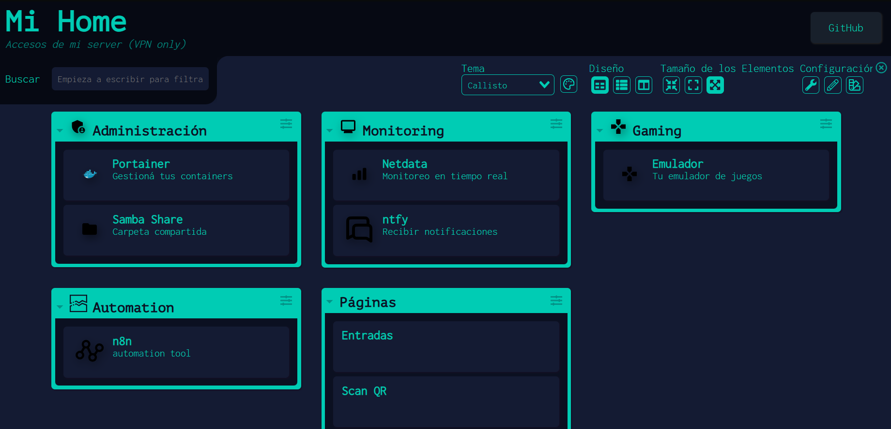
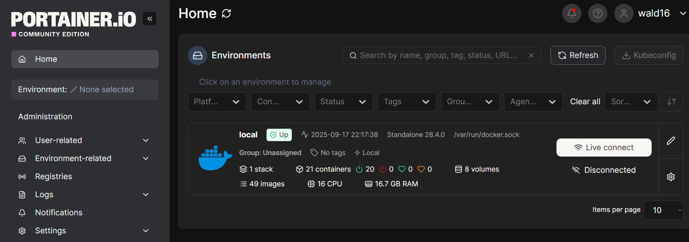
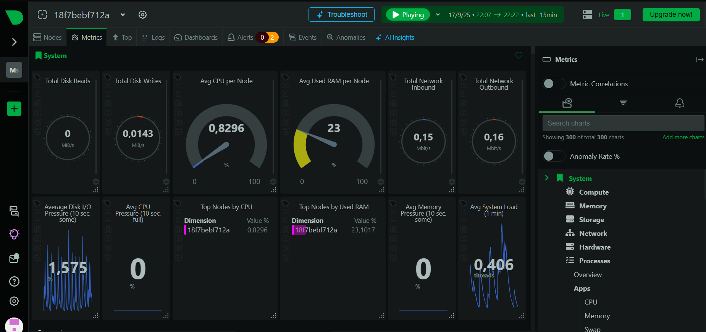
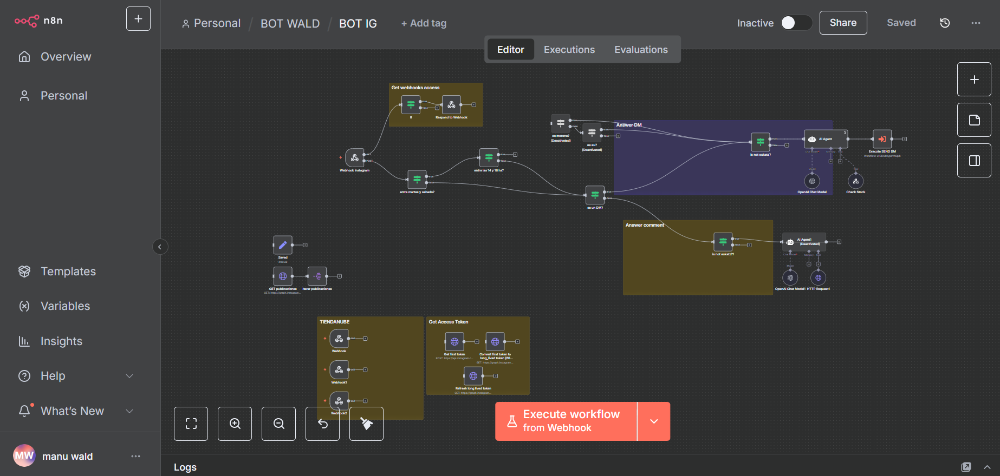

# 🏠 Homelab Infrastructure

This repository documents my **self-hosted homelab**, fully managed with Docker Compose.  
It includes applications, monitoring, automation, dashboards, file sharing, and secure remote access via VPN.

---

## 🚀 Services Included

- **WireGuard VPN** → Secure remote access to internal services  
- **Portainer** → Docker management UI  
- **Netdata** → Monitoring & metrics  
- **Dashy** → Central dashboard for all apps  
- **Samba** → File sharing service  
- **ROMM + MariaDB** → Media/game manager  
- **n8n + Cloudflare Tunnel** → Workflow automation & secure webhooks  
- **ntfy** → Push notifications  
- **Nginx** → Privacy and redirect pages  
- **Entradas System** → Ticketing system (backend, frontend, Postgres DB)  

---

## 📂 Repository Structure

```
apps.compose.yml   # Applications stack
vpn.compose.yml    # WireGuard VPN setup
.env.example       # Example environment variables (placeholders only)
README.md          # Documentation
screenshots/       # UI captures
```

---

## 🔑 Environment Variables

All sensitive values are externalized in `.env`.  
See `.env.example` for placeholders and required variables.


## 🖼️ Architecture



---

## 📸 Screenshots


```
### Dashy Dashboard


### Portainer


### Netdata Metrics


### n8n Workflow


```

---

## ⚠️ Security Notes

- This repository does **not** include real configs or credentials.  
- `.env` with sensitive values is ignored via `.gitignore`.  
- `.env.example` is provided as a safe template.  

---

## 📚 Skills Demonstrated

- **Infrastructure as Code** with Docker Compose  
- **VPN setup** with WireGuard  
- **Secure tunneling** with Cloudflare  
- **Monitoring & observability** with Netdata & healthchecks  
- **Service orchestration** across databases, apps, and dashboards  
- **Workflow automation** with n8n  
