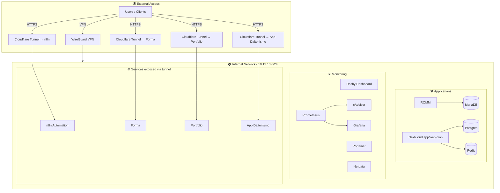
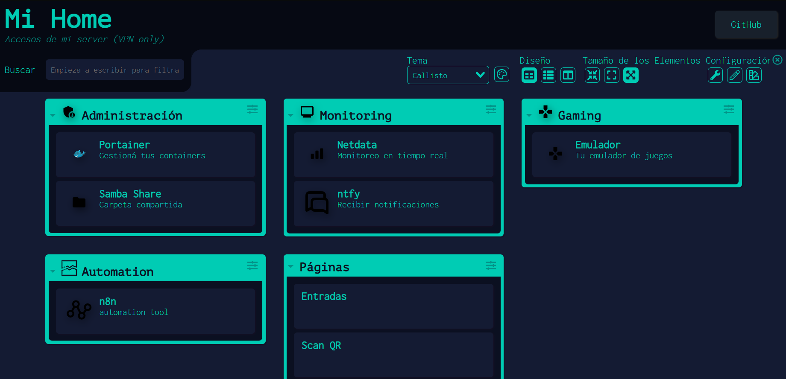
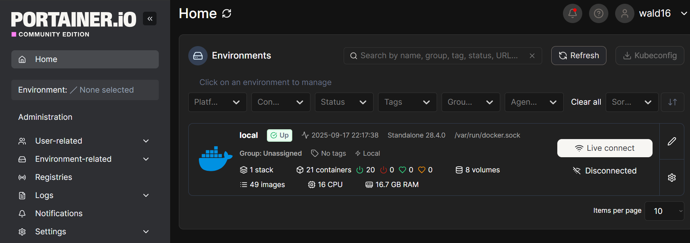
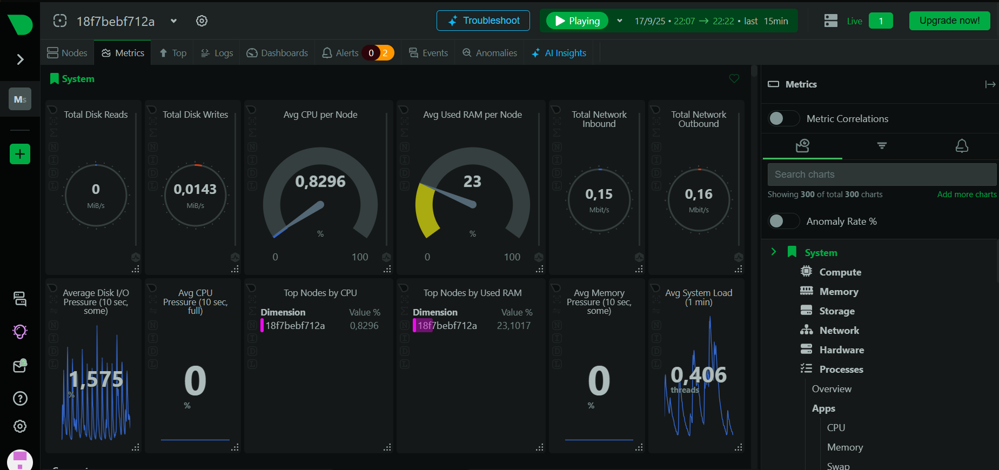
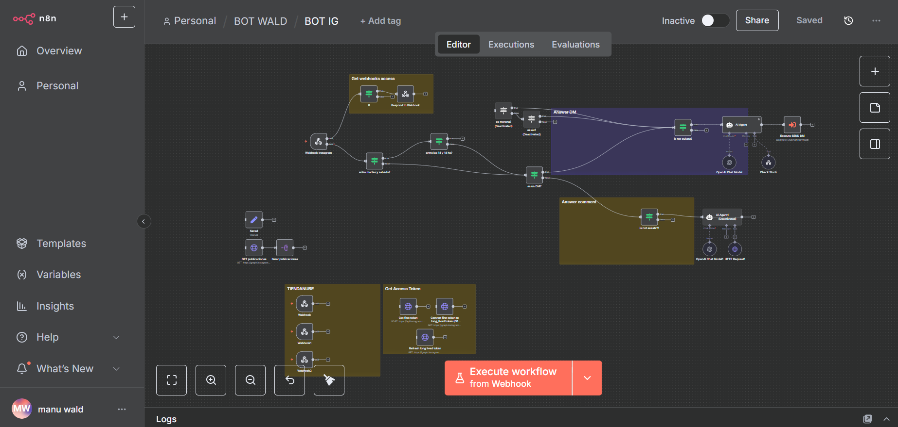

# 🏠 Homelab Infrastructure

This repository documents my **self-hosted homelab**, fully managed with Docker Compose.
It includes applications, monitoring, automation, dashboards, file sharing, and secure remote access via VPN.

---

## 🚀 Services Included

**Active**
- **WireGuard VPN** → Secure remote access to internal services
- **Portainer** → Docker management UI
- **Netdata** → Monitoring & metrics
- **Dashy** → Central dashboard for all apps
- **Samba** → File sharing service
- **ROMM + MariaDB** → Media/game manager
- **n8n + Cloudflare Tunnel** → Workflow automation & secure webhooks
- **ntfy** → Push notifications
- **Forma / Portfolio** → Static sites (nginx) exposed via their own Cloudflare Tunnel each
- **Nextcloud** (nginx + php-fpm + postgres + redis + cron) → Personal cloud storage
- **App Daltonismo** → Color blindness simulator, exposed via its own Cloudflare Tunnel
- **Prometheus + cAdvisor + Grafana** → Container metrics & dashboards

**Disabled / legacy** (kept commented in `apps.compose.yml` in case they're revived)
- Entradas System → Ticketing system (backend, frontend, Postgres DB)
- Instagram Bot redirect pages + tunnel
- Privacy page

---

## 📂 Repository Structure

```
apps.compose.yml            # Main applications stack
vpn.compose.yml             # WireGuard VPN setup
dashy/conf.yml              # Dashy dashboard config
.env.example                # Placeholders for apps.compose.yml

nextcloud/
  docker-compose.yml        # Nextcloud stack (app, web, cron, redis, postgres)
  nginx.conf                # Nginx config for the "web" service
  .env.example              # Placeholders for the Nextcloud stack

app-daltonismo/
  docker-compose.yml        # Color blindness simulator + Cloudflare Tunnel
  .env.example              # Placeholders for app-daltonismo

prometheus/
  docker-compose.yml        # Prometheus + cAdvisor + Redis + Grafana
  prometheus.yml            # Scrape config

README.md                   # Documentation
screenshots/                # UI captures
```

---

## 🔑 Environment Variables

Every compose file references `${VARIABLE}` placeholders — none of them hold real values here.
Each stack has its own `.env.example` next to its `docker-compose.yml`, with the real `.env` git-ignored.

---

## 🖼️ Architecture

### 🔒 Access & Security

```mermaid
flowchart TB
    subgraph EXT[🌍 External Access]
        U[Users / Clients]
        CF1[Cloudflare Tunnel → n8n]
        CF2[Cloudflare Tunnel → Forma]
        CF3[Cloudflare Tunnel → Portfolio]
        CF4[Cloudflare Tunnel → App Daltonismo]
        WG[WireGuard VPN]
    end

    U -->|VPN| WG
    U -->|HTTPS| CF1
    U -->|HTTPS| CF2
    U -->|HTTPS| CF3
    U -->|HTTPS| CF4

    subgraph NET[🏠 Internal Network - 10.13.13.0/24]
        subgraph APPS[🛠️ Applications]
            R[ROMM] --> MDB[(MariaDB)]
            NC[Nextcloud app/web/cron] --> PG[(Postgres)]
            NC --> RD[(Redis)]
        end

        subgraph MON[📊 Monitoring]
            D[Dashy Dashboard]
            P[Portainer]
            ND[Netdata]
            PR[Prometheus] --> CAD[cAdvisor]
            PR --> GR[Grafana]
        end

        subgraph EXP[🌐 Services exposed via tunnel]
            N8N[n8n Automation]
            F[Forma]
            PF[Portfolio]
            AD[App Daltonismo]
        end
    end

    CF1 --> N8N
    CF2 --> F
    CF3 --> PF
    CF4 --> AD

    WG --> NET
```

---

## 📸 Screenshots

### Dashy Dashboard


### Portainer


### Netdata Metrics


### n8n Workflow


---

## ⚠️ Security Notes

- This repository does **not** include real configs or credentials.
- Every `.env` is ignored via `.gitignore` (`.env`, `*.env`, `.env.*`, keeping only `.env.example` files).
- Each `.env.example` is provided as a safe template for its corresponding stack.

---

## 📚 Skills Demonstrated

- **Infrastructure as Code** with Docker Compose
- **VPN setup** with WireGuard
- **Secure tunneling** with Cloudflare Tunnels
- **Monitoring & observability** with Netdata, Prometheus, cAdvisor & Grafana
- **Service orchestration** across databases, apps, and dashboards
- **Workflow automation** with n8n
